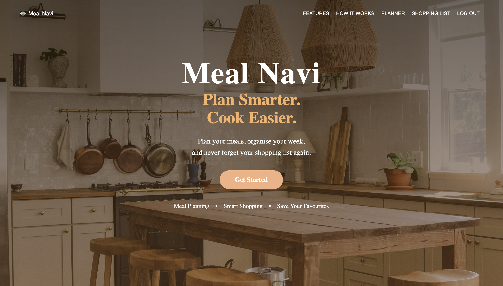

# Meal Navi

Plan smarter. Shop easier.

Meal Navi is a full-stack meal planning application designed to help users discover recipes, organise their meals for the week, and generate shopping lists.

The project was built to solve a practical everyday problem while demonstrating modern full-stack web development skills.

## Features

- User registration and login
- JWT authentication
- Password hashing with bcrypt
- User profiles
- Recipe discovery and search
- Recipe details and ingredients
- Weekly meal planner
- Breakfast, lunch and dinner planning
- Persistent meal plans
- Automatic shopping list generation
- Add, check and delete shopping-list items
- Persistent shopping lists
- Responsive design

## Tech Stack

### Frontend

- React
- Vite
- JavaScript
- HTML
- CSS
- Material UI
- React Router

### Backend

- Node.js
- Express.js
- RESTful APIs

### Database

- MongoDB
- Mongoose

### Authentication

- JSON Web Tokens (JWT)
- bcrypt

### APIs

- Recipe API integration

## How It Works

### Recipe Discovery

Users can search for recipes and view recipe details, including ingredients and instructions.

### Meal Planning

Recipes can be added to a weekly planner with separate slots for breakfast, lunch and dinner.

### Shopping Lists

Users can generate a shopping list from their planned meals and manage the list by adding, checking and deleting items.

## Screenshots

### Homepage



## Project Structure

```text
Meal-Navi/
├── client/
│   └── src/
│       ├── components/
│       ├── pages/
│       └── services/
│
├── server/
│   ├── config/
│   ├── controllers/
│   ├── middleware/
│   ├── models/
│   ├── routes/
│   └── utils/
│
├── package.json
└── README.md
```

## Project Goals

This project demonstrates practical experience with:

- Full-stack web development
- React application development
- RESTful API development
- Authentication and authorisation
- Database design with MongoDB and Mongoose
- CRUD operations
- API integration
- React state management
- Responsive UI development
- Git and GitHub
- Building and debugging a complete application

## Future Improvements

Possible future improvements include:

- Nutrition information
- High-protein recipe recommendations
- Pantry tracking
- Leftover meal suggestions
- Dark mode
- Production deployment

## Author

Matt Swales

Built as a portfolio project to demonstrate full-stack web development skills.
