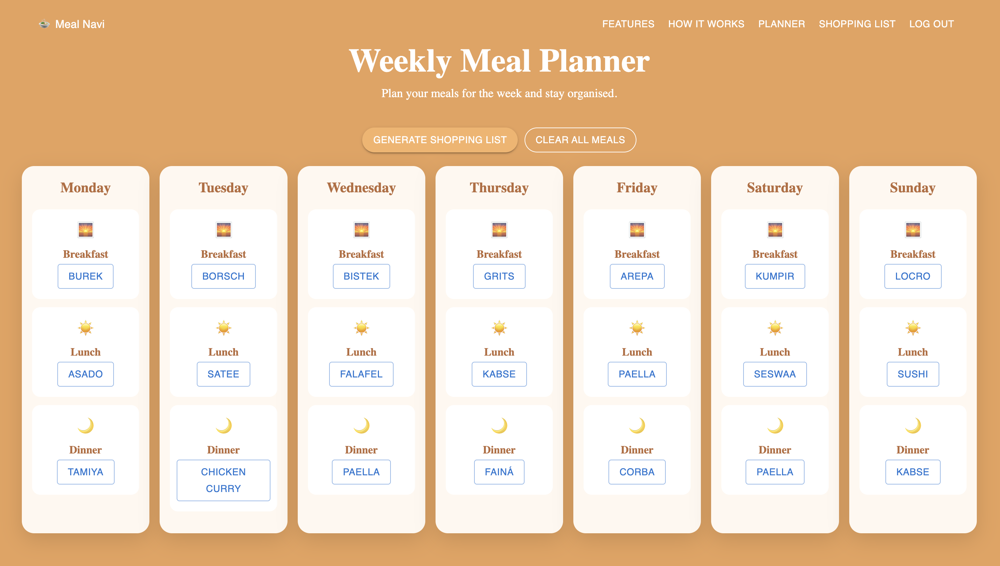
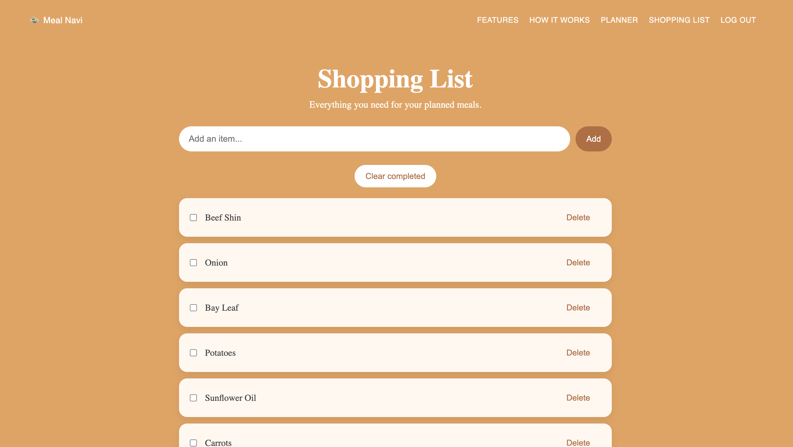

# Meal Navi

**Plan smarter. Shop easier.**

Meal Navi is a full-stack meal planning application designed to help users discover recipes, organise meals for the week, and generate shopping lists.

Built as a portfolio project to demonstrate practical full-stack web development skills across React, Node.js, Express, MongoDB, authentication, API integration, and deployment.

**Live Demo:** https://meal-navi.vercel.app/
**GitHub:** https://github.com/mjsdev7/Meal-Navi

---

## Features

- User registration and login
- JWT authentication
- Password hashing with bcrypt
- User profiles
- Recipe discovery and search
- Recipe details, ingredients, and instructions
- Weekly meal planner
- Breakfast, lunch, and dinner planning
- Persistent meal plans
- Automatic shopping list generation
- Add, check, and delete shopping-list items
- Persistent shopping lists
- Responsive design

---

## Tech Stack

### Frontend

- React
- Vite
- JavaScript
- HTML
- CSS
- Material UI
- React Router

### Backend

- Node.js
- Express.js
- RESTful APIs

### Database

- MongoDB
- Mongoose

### Authentication

- JSON Web Tokens (JWT)
- bcrypt

### APIs & Deployment

- Recipe API integration
- Vercel
- Render
- MongoDB Atlas

---

## How It Works

### Recipe Discovery

Users can search for recipes and view recipe details, including ingredients and instructions.

### Meal Planning

Recipes can be added to a weekly planner with separate slots for breakfast, lunch, and dinner.

### Shopping Lists

Users can generate a shopping list from planned meals and manage the list by adding, checking, and deleting items.

---

## Screenshots

### Homepage


### Weekly Meal Planner



### Shopping List



---

## Project Structure

```text
Meal-Navi/
├── client/
│   └── src/
│       ├── components/
│       ├── pages/
│       └── services/
│
├── server/
│   ├── config/
│   ├── controllers/
│   ├── middleware/
│   ├── models/
│   ├── routes/
│   └── utils/
│
├── package.json
└── README.md
```

---

## Project Goals

This project demonstrates practical experience with:

- Full-stack web development
- React application development
- RESTful API development
- Authentication and authorisation
- Database design with MongoDB and Mongoose
- CRUD operations
- External API integration
- React state management
- Responsive UI development
- Git and GitHub
- Deployment and production configuration
- Debugging across frontend and backend environments

---

## Future Improvements

Possible future improvements include:

- Nutrition information
- High-protein recipe recommendations
- Pantry tracking
- Leftover meal suggestions
- Dark mode

---

## Deployment

Meal Navi is deployed as a separate frontend and backend application.

**Frontend:** Vercel
**Backend:** Render
**Database:** MongoDB Atlas

Environment variables are used to configure API URLs and sensitive application settings for development and production environments.

---

## Author

**Matt Swales**

Built as a portfolio project to demonstrate full-stack web development skills.
